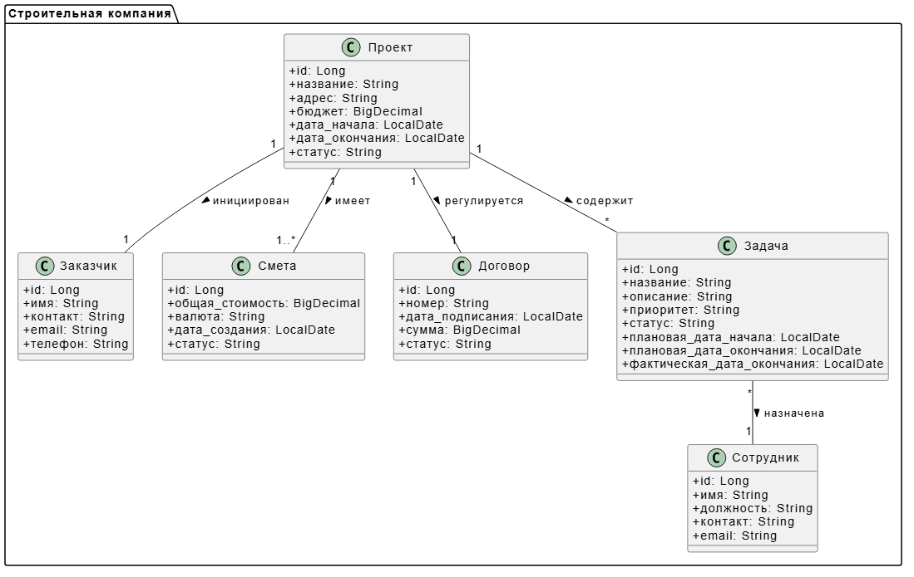

# Диаграмма бизнес-классов

## Описание

Диаграмма показывает основные сущности предметной области "Строительная компания" и их связи.

## Структура

### Основные классы:

- **Проект** - строительный объект с бюджетом и сроками
- **Заказчик** - клиент компании
- **Смета** - расчет стоимости строительства
- **Сотрудник** - исполнитель работ
- **Договор** - юридическое соглашение
- **Задача** - конкретная работа в проекте

### Связи:

- Проект → Заказчик (1:1)
- Проект → Смета (1:*)
- Проект → Договор (1:1)
- Проект → Задача (1:*)
- Задача → Сотрудник (*:1)

## PUML код

```puml
skinparam classAttributeIconSize 0

package "Строительная компания" {
    class Проект {
        +id: Long
        +название: String
        +адрес: String
        +бюджет: BigDecimal
        +дата_начала: LocalDate
        +дата_окончания: LocalDate
        +статус: String
    }

    class Заказчик {
        +id: Long
        +имя: String
        +контакт: String
        +email: String
        +телефон: String
    }

    class Смета {
        +id: Long
        +общая_стоимость: BigDecimal
        +валюта: String
        +дата_создания: LocalDate
        +статус: String
    }

    class Сотрудник {
        +id: Long
        +имя: String
        +должность: String
        +контакт: String
        +email: String
    }

    class Договор {
        +id: Long
        +номер: String
        +дата_подписания: LocalDate
        +сумма: BigDecimal
        +статус: String
    }

    class Задача {
        +id: Long
        +название: String
        +описание: String
        +приоритет: String
        +статус: String
        +плановая_дата_начала: LocalDate
        +плановая_дата_окончания: LocalDate
        +фактическая_дата_окончания: LocalDate
    }

    Проект "1" -- "*"" Заказчик : инициирован >
    Проект "1" -- "*"" Смета : имеет >
    Проект "1" -- "*"" Договор : регулируется >
    Проект "1" -- "*"" Задача : содержит >
    Задача "*"" -- "1"" Сотрудник : назначена >
}
```

## Скриншот


