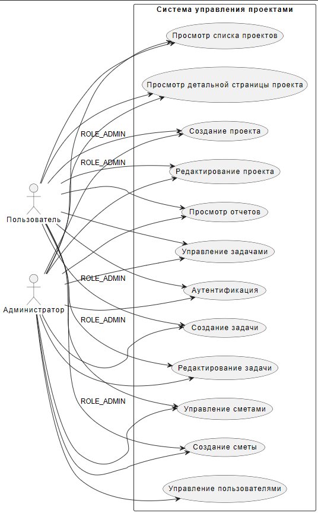

@startuml
left to right direction
actor "Пользователь" as user
actor "Администратор" as admin

rectangle "Система управления проектами" {
    usecase "Аутентификация" as uc_auth
    usecase "Просмотр списка проектов" as uc_list_projects
    usecase "Просмотр детальной страницы проекта" as uc_detail_project
    usecase "Создание проекта" as uc_create_project
    usecase "Редактирование проекта" as uc_edit_project
    usecase "Управление задачами" as uc_tasks
    usecase "Создание задачи" as uc_create_task
    usecase "Редактирование задачи" as uc_edit_task
    usecase "Управление сметами" as uc_estimates
    usecase "Создание сметы" as uc_create_estimate
    usecase "Просмотр отчетов" as uc_reports
    usecase "Управление пользователями" as uc_users
}

user --> uc_auth
user --> uc_list_projects
user --> uc_detail_project
user --> uc_create_project : ROLE_ADMIN
user --> uc_edit_project : ROLE_ADMIN
user --> uc_tasks
user --> uc_create_task : ROLE_ADMIN
user --> uc_edit_task : ROLE_ADMIN
user --> uc_estimates
user --> uc_create_estimate : ROLE_ADMIN
user --> uc_reports

admin --> uc_auth
admin --> uc_list_projects
admin --> uc_detail_project
admin --> uc_create_project
admin --> uc_edit_project
admin --> uc_tasks
admin --> uc_create_task
admin --> uc_edit_task
admin --> uc_estimates
admin --> uc_create_estimate
admin --> uc_reports
admin --> uc_users

@enduml
