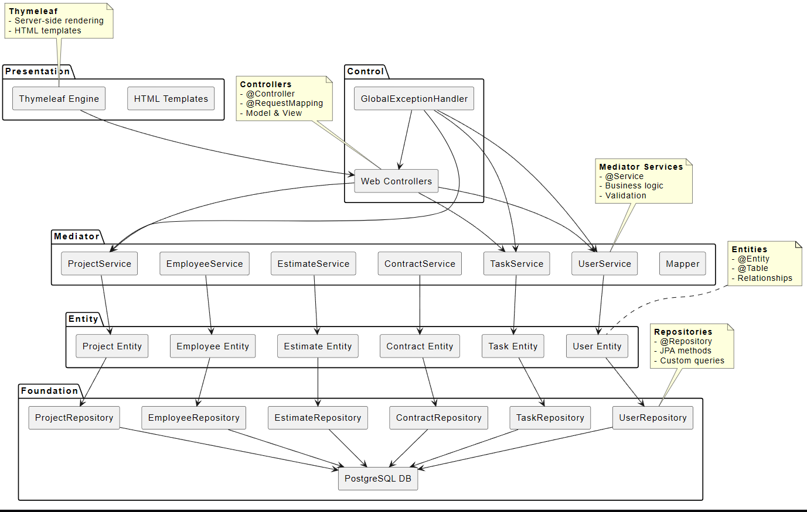

# Компонентная диаграмма

## Описание

Диаграмма показывает компонентную структуру системы с распределением по слоям PCMEF.

## Компоненты по слоям

### Presentation Layer
- **Thymeleaf Engine** - Шаблонный движок
- **HTML Templates** - HTML шаблоны

### Control Layer
- **Web Controllers** - Контроллеры @Controller
- **GlobalExceptionHandler** - Обработчик исключений

### Mediator Layer
- **UserService** - Бизнес-логика пользователей
- **ProjectService** - Бизнес-логика проектов
- **TaskService** - Бизнес-логика задач
- **EmployeeService** - Бизнес-логика сотрудников
- **EstimateService** - Бизнес-логика смет
- **ContractService** - Бизнес-логика договоров
- **Mapper** - Мапперы DTO

### Entity Layer
- **User Entity** - Сущность User
- **Project Entity** - Сущность Project
- **Task Entity** - Сущность Task
- **Employee Entity** - Сущность Employee
- **Estimate Entity** - Сущность Estimate
- **Contract Entity** - Сущность Contract

### Foundation Layer
- **UserRepository** - Репозиторий User
- **ProjectRepository** - Репозиторий Project
- **TaskRepository** - Репозиторий Task
- **EmployeeRepository** - Репозиторий Employee
- **EstimateRepository** - Репозиторий Estimate
- **ContractRepository** - Репозиторий Contract
- **PostgreSQL DB** - База данных

## Зависимости

Все зависимости идут сверху вниз. Исключения (GlobalExceptionHandler) идут вверх.

## PUML код

```puml
skinparam componentStyle rectangle

package "Presentation" {
    component "Thymeleaf Engine" as thymeleaf
    component "HTML Templates" as html_templates
}

package "Control" {
    component "Web Controllers" as controllers
    component "GlobalExceptionHandler" as exception_handler
}

package "Mediator" {
    component "UserService" as user_service
    component "ProjectService" as project_service
    component "TaskService" as task_service
    component "EmployeeService" as employee_service
    component "EstimateService" as estimate_service
    component "ContractService" as contract_service
    component "Mapper" as mapper
}

package "Entity" {
    component "User Entity" as user_entity
    component "Project Entity" as project_entity
    component "Task Entity" as task_entity
    component "Employee Entity" as employee_entity
    component "Estimate Entity" as estimate_entity
    component "Contract Entity" as contract_entity
}

package "Foundation" {
    component "UserRepository" as user_repo
    component "ProjectRepository" as project_repo
    component "TaskRepository" as task_repo
    component "EmployeeRepository" as employee_repo
    component "EstimateRepository" as estimate_repo
    component "ContractRepository" as contract_repo
    component "PostgreSQL DB" as database
}

' Dependencies (unidirectional, top to bottom)
thymeleaf --> controllers
controllers --> user_service
controllers --> project_service
controllers --> task_service

user_service --> user_entity
project_service --> project_entity
task_service --> task_entity
employee_service --> employee_entity
estimate_service --> estimate_entity
contract_service --> contract_entity

user_entity --> user_repo
project_entity --> project_repo
task_entity --> task_repo
employee_entity --> employee_repo
estimate_entity --> estimate_repo
contract_entity --> contract_repo

user_repo --> database
project_repo --> database
task_repo --> database
employee_repo --> database
estimate_repo --> database
contract_repo --> database

' Exceptions go up
exception_handler --> controllers
exception_handler --> user_service
exception_handler --> project_service
exception_handler --> task_service

note top of thymeleaf
    <b>Thymeleaf</b>
    - Server-side rendering
    - HTML templates
end note

note top of controllers
    <b>Controllers</b>
    - @Controller
    - @RequestMapping
    - Model & View
end note

note top of user_service
    <b>Mediator Services</b>
    - @Service
    - Business logic
    - Validation
end note

note top of user_entity
    <b>Entities</b>
    - @Entity
    - @Table
    - Relationships
end note

note top of user_repo
    <b>Repositories</b>
    - @Repository
    - JPA methods
    - Custom queries
end note
```

## Скриншот


