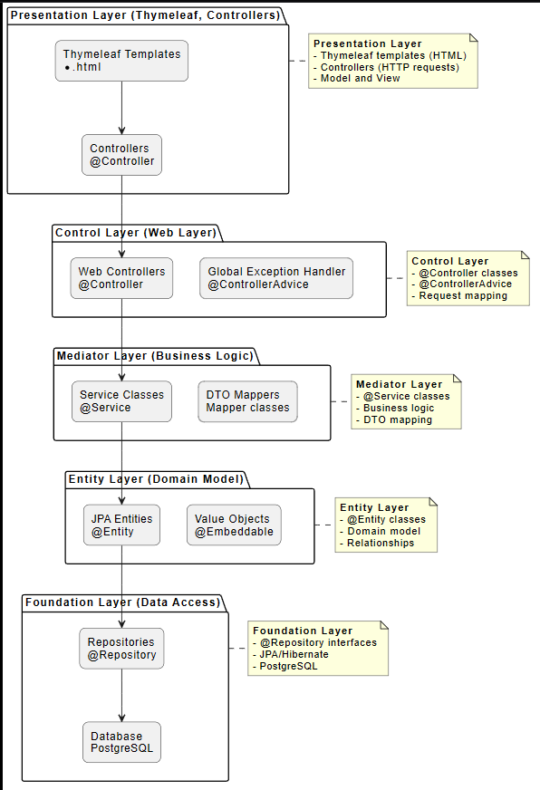

# Диаграмма слоистой архитектуры PCMEF

## Описание

Диаграмма показывает слоистую архитектуру PCMEF (Presentation → Control → Mediator → Entity → Foundation).

## Структура слоев

### 1. Presentation Layer
- **Thymeleaf Templates** - HTML шаблоны
- **Controllers** - Web контроллеры @Controller

### 2. Control Layer
- **Web Controllers** - Классы @Controller
- **Global Exception Handler** - Обработка исключений @ControllerAdvice

### 3. Mediator Layer
- **Service Classes** - Классы @SERVICE с бизнес-логикой
- **DTO Mappers** - Мапперы для преобразования объектов

### 4. Entity Layer
- **JPA Entities** - Классы @Entity
- **Value Objects** - Вложенные объекты @Embeddable

### 5. Foundation Layer
- **Repositories** - Классы @Repository
- **Database** - PostgreSQL

## Правила

- Все зависимости идут **сверху вниз**
- Циклические зависимости **запрещены**
- Каждый слой зависит только от слоя ниже

## PUML код

```puml
skinparam rectangle {
    roundCorner 15
    shadowing false
}

package "Presentation Layer (Thymeleaf, Controllers)" as presentation {
    rectangle "Thymeleaf Templates\n*.html" as templates
    rectangle "Controllers\n@Controller" as controllers
}

package "Control Layer (Web Layer)" as control {
    rectangle "Web Controllers\n@Controller" as web_controllers
    rectangle "Global Exception Handler\n@ControllerAdvice" as exception_handler
}

package "Mediator Layer (Business Logic)" as mediator {
    rectangle "Service Classes\n@Service" as services
    rectangle "DTO Mappers\nMapper classes" as mappers
}

package "Entity Layer (Domain Model)" as entity {
    rectangle "JPA Entities\n@Entity" as entities
    rectangle "Value Objects\n@Embeddable" as value_objects
}

package "Foundation Layer (Data Access)" as foundation {
    rectangle "Repositories\n@Repository" as repositories
    rectangle "Database\nPostgreSQL" as database
}

' Dependencies (top to bottom)
templates --> controllers
controllers --> web_controllers
web_controllers --> services
services --> entities
entities --> repositories
repositories --> database

' Cross-layer dependencies are NOT allowed
' All dependencies must go TOP to BOTTOM

note right of presentation
    <b>Presentation Layer</b>
    - Thymeleaf templates (HTML)
    - Controllers (HTTP requests)
    - Model and View
end note

note right of control
    <b>Control Layer</b>
    - @Controller classes
    - @ControllerAdvice
    - Request mapping
end note

note right of mediator
    <b>Mediator Layer</b>
    - @Service classes
    - Business logic
    - DTO mapping
end note

note right of entity
    <b>Entity Layer</b>
    - @Entity classes
    - Domain model
    - Relationships
end note

note right of foundation
    <b>Foundation Layer</b>
    - @Repository interfaces
    - JPA/Hibernate
    - PostgreSQL
end note
```

## Скриншот


