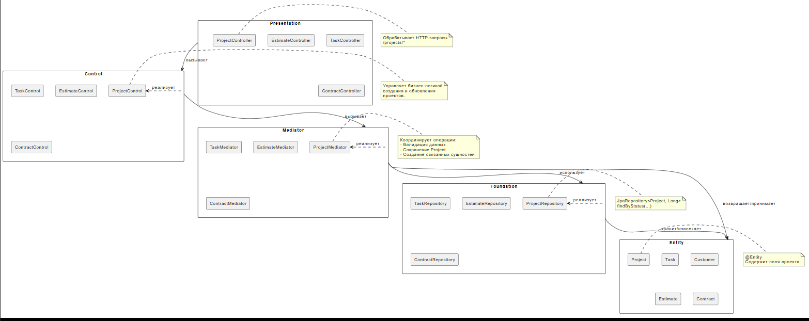

# Диаграмма зависимостей

## Описание

Диаграмма показывает зависимости между компонентами разных слоев архитектуры.

## Компоненты по слоям

### Presentation Layer
- **ProjectController** - Контроллер для проектов
- **TaskController** - Контроллер для задач
- **EstimateController** - Контроллер для смет
- **ContractController** - Контроллер для договоров

### Control Layer
- **ProjectControl** - Управление проектами
- **TaskControl** - Управление задачами
- **EstimateControl** - Управление сметами
- **ContractControl** - Управление договорами

### Mediator Layer
- **ProjectMediator** - Посредник для проектов
- **TaskMediator** - Посредник для задач
- **EstimateMediator** - Посредник для смет
- **ContractMediator** - Посредник для договоров

### Foundation Layer
- **ProjectRepository** - Репозиторий проектов
- **TaskRepository** - Репозиторий задач
- **EstimateRepository** - Репозиторий смет
- **ContractRepository** - Репозиторий договоров

### Entity Layer
- **Project** - Сущность Project
- **Task** - Сущность Task
- **Customer** - Сущность Customer
- **Estimate** - Сущность Estimate
- **Contract** - Сущность Contract

## Зависимости

**Прямые зависимости (сверху вниз):**
- presentation → control
- control → mediator
- mediator → foundation
- mediator → entity
- foundation → entity

**Запрещенные зависимости:**
- entity → presentation (низ → верх)
- control → presentation (боком)
- foundation → control (низ → верх)

## PUML код

```puml
skinparam componentStyle rectangle
skinparam defaultFontName Arial
skinparam defaultFontSize 12

' Определяем компоненты (слои)
component "Presentation" as presentation {
  [ProjectController]
  [TaskController]
  [EstimateController]
  [ContractController]
}

component "Control" as control {
  [ProjectControl]
  [TaskControl]
  [EstimateControl]
  [ContractControl]
}

component "Mediator" as mediator {
  [ProjectMediator]
  [TaskMediator]
  [EstimateMediator]
  [ContractMediator]
}

component "Foundation" as foundation {
  [ProjectRepository]
  [TaskRepository]
  [EstimateRepository]
  [ContractRepository]
}

component "Entity" as entity {
  [Project]
  [Task]
  [Customer]
  [Estimate]
  [Contract]
}

' Зависимости между слоями
presentation --> control : вызывает
control --> mediator : вызывает
mediator --> foundation : использует
mediator --> entity : возвращает/принимает
foundation --> entity : хранит/извлекает

' Примеры зависимостей внутри слоев
control .> ProjectControl : реализует
mediator .> ProjectMediator : реализует
foundation .> ProjectRepository : реализует

' Запрещенные зависимости (для визуализации)
' entity -.> presentation : запрещено
' control -.> presentation : запрещено
' foundation -.> control : запрещено

note right of ProjectController
  Обрабатывает HTTP-запросы
  /projects/*
end note

note right of ProjectControl
  Управляет бизнес-логикой
  создания и обновления
  проектов.
end note

note right of ProjectMediator
  Координирует операции:
  - Валидация данных
  - Сохранение Project
  - Создание связанных сущностей
end note

note right of ProjectRepository
  JpaRepository<Project, Long>
  findByStatus(...)
end note

note right of Project
  @Entity
  Содержит поля проекта
end note
```

## Скриншот


