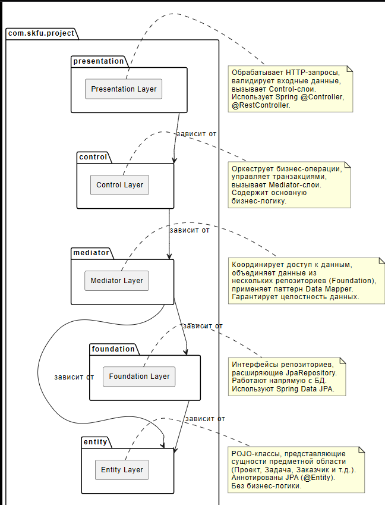

# Диаграмма пакетов

## Описание

Диаграмма показывает структуру пакетов Java проекта и зависимости между ними.

## Пакеты

### com.skfu.project
Корневой пакет проекта.

### presentation (Presentation Layer)
- Обрабатывает HTTP-запросы
- Валидирует входные данные
- Вызывает Control-слои
- Использует Spring @Controller, @RestController

### control (Control Layer)
- Оркеструет бизнес-операции
- Управляет транзакциями
- Вызывает Mediator-слои
- Содержит основную бизнес-логику

### mediator (Mediator Layer)
- Координирует доступ к данным
- Объединяет данные из нескольких репозиториев
- Применяет паттерн Data Mapper
- Гарантирует целостность данных

### entity (Entity Layer)
- POJO-классы, представляющие сущности предметной области
- Аннотированы JPA (@Entity)
- Без бизнес-логики
- Сущности: Project, Customer, Estimate, Employee, Contract, Task, User

### foundation (Foundation Layer)
- Интерфейсы репозиториев
- Расширяют JpaRepository
- Работают напрямую с БД
- Используют Spring Data JPA

## Правила зависимостей

**Разрешенные зависимости (сверху вниз):**
- presentation → control
- control → mediator
- mediator → foundation
- mediator → entity
- foundation → entity

**Запрещенные зависимости:**
- entity → presentation (низ → верх)
- control → presentation (боком)
- foundation → control (низ → верх)

## PUML код

```puml
skinparam componentStyle rectangle
skinparam defaultFontName Arial
skinparam defaultFontSize 12

package "com.skfu.project" as root {
  
  package "presentation" as presentation {
    ' Контроллеры, обрабатывающие HTTP-запросы
    [Presentation Layer] as presentation_layer
  }
  
  package "control" as control {
    ' Оркестраторы бизнес-операций
    [Control Layer] as control_layer
  }
  
  package "mediator" as mediator {
    ' Слой-посредник, координирующий доступ к данным
    [Mediator Layer] as mediator_layer
  }
  
  package "entity" as entity {
    ' Сущности предметной области
    [Entity Layer] as entity_layer
  }
  
  package "foundation" as foundation {
    ' Репозитории, работающие напрямую с БД
    [Foundation Layer] as foundation_layer
  }
}

' Строгие зависимости (сверху вниз)
presentation --> control : зависит от
control --> mediator : зависит от
mediator --> foundation : зависит от
mediator --> entity : зависит от
foundation --> entity : зависит от

' Запрещенные зависимости (для визуализации)
' entity -.-> presentation : запрещено
' control -.-> presentation : запрещено
' foundation -.-> control : запрещено

note right of presentation_layer
  Обрабатывает HTTP-запросы,
  валидирует входные данные,
  вызывает Control-слои.
  Использует Spring @Controller,
  @RestController.
end note

note right of control_layer
  Оркеструет бизнес-операции,
  управляет транзакциями,
  вызывает Mediator-слои.
  Содержит основную
  бизнес-логику.
end note

note right of mediator_layer
  Координирует доступ к данным,
  объединяет данные из
  нескольких репозиториев (Foundation),
  применяет паттерн Data Mapper.
  Гарантирует целостность данных.
end note

note right of entity_layer
  POJO-классы, представляющие
  сущности предметной области
  (Проект, Задача, Заказчик и т.д.).
  Аннотированы JPA (@Entity).
  Без бизнес-логики.
end note

note right of foundation_layer
  Интерфейсы репозиториев,
  расширяющие JpaRepository.
  Работают напрямую с БД.
  Используют Spring Data JPA.
end note
```

## Скриншот


