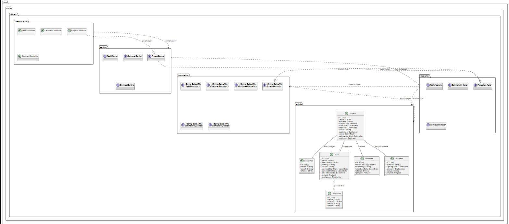

# Детальная диаграмма классов

## Описание

Диаграмма показывает детальную структуру классов по пакетам.

## Пакет entity (com.skfu.project.entity)

### Project
```
+id: Long
+name: String
+address: String
+budget: BigDecimal
+startDate: LocalDate
+endDate: LocalDate
+status: String
+customer: Customer
+tasks: List<Task>
+estimates: List<Estimate>
+contract: Contract
```

### Customer
```
+id: Long
+name: String
+email: String
+phone: String
```

### Task
```
+id: Long
+name: String
+description: String
+priority: String
+status: String
+plannedStartDate: LocalDate
+plannedEndDate: LocalDate
+actualEndDate: LocalDate
+project: Project
+employee: Employee
```

### Employee
```
+id: Long
+name: String
+position: String
+email: String
+phone: String
```

### Estimate
```
+id: Long
+totalCost: BigDecimal
+currency: String
+creationDate: LocalDate
+status: String
+project: Project
```

### Contract
```
+id: Long
+number: String
+signingDate: LocalDate
+amount: BigDecimal
+status: String
+project: Project
```

## Пакет foundation (com.skfu.project.foundation)

- **ProjectRepository** - Spring Data JPA
- **TaskRepository** - Spring Data JPA
- **CustomerRepository** - Spring Data JPA
- **EmployeeRepository** - Spring Data JPA
- **EstimateRepository** - Spring Data JPA
- **ContractRepository** - Spring Data JPA

## Пакет mediator (com.skfu.project.mediator)

- **ProjectMediator**
- **TaskMediator**
- **EstimateMediator**
- **ContractMediator**

## Пакет control (com.skfu.project.control)

- **ProjectControl**
- **TaskControl**
- **EstimateControl**
- **ContractControl**

## Пакет presentation (com.skfu.project.presentation)

- **ProjectController**
- **TaskController**
- **EstimateController**
- **ContractController**

## Зависимости между пакетами

- presentation → control
- control → mediator
- mediator → foundation
- mediator → entity
- foundation → entity

## PUML код

```puml
skinparam classAttributeIconSize 0
skinparam defaultFontName Arial
skinparam defaultFontSize 12

' Пакет entity
package "com.skfu.project.entity" {
  class Project {
    +id: Long
    +name: String
    +address: String
    +budget: BigDecimal
    +startDate: LocalDate
    +endDate: LocalDate
    +status: String
    +customer: Customer
    +tasks: List<Task>
    +estimates: List<Estimate>
    +contract: Contract
  }

  class Customer {
    +id: Long
    +name: String
    +email: String
    +phone: String
  }

  class Task {
    +id: Long
    +name: String
    +description: String
    +priority: String
    +status: String
    +plannedStartDate: LocalDate
    +plannedEndDate: LocalDate
    +actualEndDate: LocalDate
    +project: Project
    +employee: Employee
  }

  class Employee {
    +id: Long
    +name: String
    +position: String
    +email: String
    +phone: String
  }

  class Estimate {
    +id: Long
    +totalCost: BigDecimal
    +currency: String
    +creationDate: LocalDate
    +status: String
    +project: Project
  }

  class Contract {
    +id: Long
    +number: String
    +signingDate: LocalDate
    +amount: BigDecimal
    +status: String
    +project: Project
  }

  Project "1" -- "1" Customer : инициирует
  Project "1" -- "*" Task : содержит
  Project "1" -- "*" Estimate : имеет
  Project "1" -- "1" Contract : регулируется
  Task "*" -- "1" Employee : назначена
}

' Пакет foundation
package "com.skfu.project.foundation" {
  interface ProjectRepository <<Spring Data JPA>>
  interface TaskRepository <<Spring Data JPA>>
  interface CustomerRepository <<Spring Data JPA>>
  interface EmployeeRepository <<Spring Data JPA>>
  interface EstimateRepository <<Spring Data JPA>>
  interface ContractRepository <<Spring Data JPA>>
}

' Пакет mediator
package "com.skfu.project.mediator" {
  interface ProjectMediator
  interface TaskMediator
  interface EstimateMediator
  interface ContractMediator
}

' Пакет control
package "com.skfu.project.control" {
  interface ProjectControl
  interface TaskControl
  interface EstimateControl
  interface ContractControl
}

' Пакет presentation
package "com.skfu.project.presentation" {
  class ProjectController
  class TaskController
  class EstimateController
  class ContractController
}

' Зависимости между пакетами
presentation ..> control : использует
control ..> mediator : использует
mediator ..> foundation : использует
mediator ..> entity : использует
foundation ..> entity : использует

' Пример реализации
ProjectController ..|> ProjectControl : реализует
ProjectControl ..|> ProjectMediator : реализует
ProjectMediator ..|> ProjectRepository : использует
```

## Скриншот


