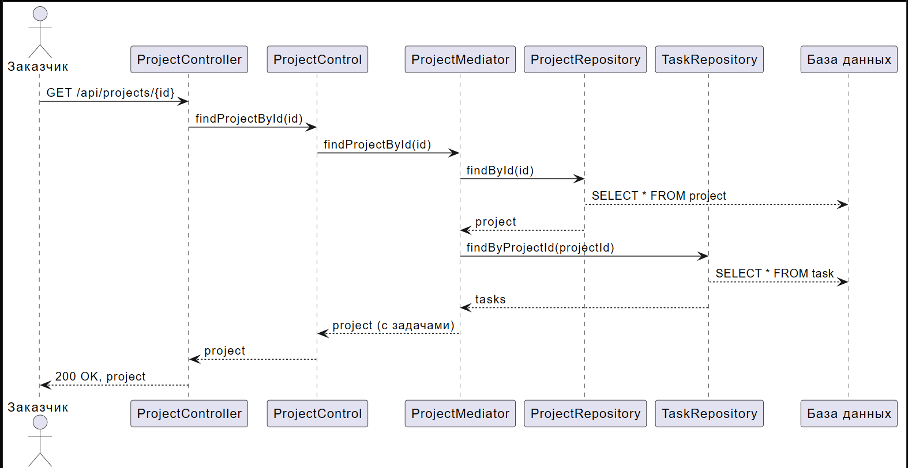

# Диаграмма последовательности: Просмотр статуса проекта

## Описание

Диаграмма показывает последовательность вызовов при просмотре статуса проекта с задачами.

## Участники

- **Заказчик** - Пользователь, просматривающий статус проекта
- **ProjectController** - REST контроллер
- **ProjectControl** - Контроллер бизнес-логики
- **ProjectMediator** - Посредник для проектов
- **ProjectRepository** - Репозиторий для работы с БД
- **TaskRepository** - Репозиторий задач
- **База данных** - PostgreSQL

## Сценарий

1. Заказчик отправляет GET запрос на `/api/projects/{id}`
2. ProjectController вызывает ProjectControl
3. ProjectControl вызывает ProjectMediator
4. ProjectMediator загружает проект из БД
5. ProjectMediator загружает задачи проекта через TaskRepository
6. Ответ возвращается клиенту с кодом 200 OK

## PUML код

```puml
actor Заказчик as customer
participant "ProjectController" as pc
participant "ProjectControl" as pco
participant "ProjectMediator" as pm
participant "ProjectRepository" as pr
participant "TaskRepository" as tr
participant "База данных" as db

customer -> pc: GET /api/projects/{id}
pc -> pco: findProjectById(id)
pco -> pm: findProjectById(id)
pm -> pr: findById(id)
pr --> db: SELECT * FROM project
pr --> pm: project

' Загрузка связанных задач
pm -> tr: findByProjectId(projectId)
tr --> db: SELECT * FROM task
tr --> pm: tasks

pm --> pco: project (с задачами)
pco --> pc: project
pc --> customer: 200 OK, project
```

## Скриншот


