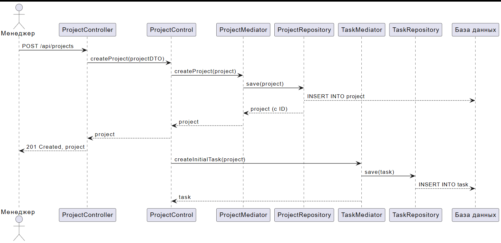

# Диаграмма последовательности: Создание проекта

## Описание

Диаграмма показывает последовательность вызовов при создании нового проекта.

## Участники

- **Менеджер** - Пользователь, создающий проект
- **ProjectController** - REST контроллер
- **ProjectControl** - Контроллер бизнес-логики
- **ProjectMediator** - Посредник для проектов
- **ProjectRepository** - Репозиторий для работы с БД
- **TaskMediator** - Посредник для задач
- **TaskRepository** - Репозиторий задач
- **База данных** - PostgreSQL

## Сценарий

1. Менеджер отправляет POST запрос на `/api/projects`
2. ProjectController вызывает ProjectControl
3. ProjectControl вызывает ProjectMediator
4. ProjectMediator сохраняет проект в БД через ProjectRepository
5. После сохранения создается начальная задача
6. Ответ возвращается клиенту с кодом 201 Created

## PUML код

```puml
actor Менеджер as manager
participant "ProjectController" as pc
participant "ProjectControl" as pco
participant "ProjectMediator" as pm
participant "ProjectRepository" as pr
participant "TaskMediator" as tm
participant "TaskRepository" as tr
participant "База данных" as db

manager -> pc: POST /api/projects
pc -> pco: createProject(projectDTO)
pco -> pm: createProject(project)
pm -> pr: save(project)
pr --> db: INSERT INTO project
pr --> pm: project (с ID)
pm --> pco: project
pco --> pc: project
pc --> manager: 201 Created, project

' Автоматическое создание задачи
pco -> tm: createInitialTask(project)
tm -> tr: save(task)
tr --> db: INSERT INTO task
tm --> pco: task
```

## Скриншот


