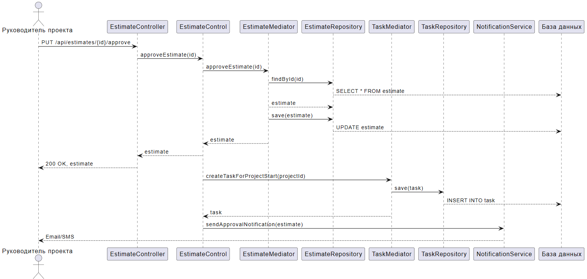

# Диаграмма последовательности: Утверждение сметы

## Описание

Диаграмма показывает последовательность вызовов при утверждении сметы.

## Участники

- **Руководитель проекта** - Пользователь, утверждающий смету
- **EstimateController** - REST контроллер смет
- **EstimateControl** - Контроллер бизнес-логики смет
- **EstimateMediator** - Посредник для смет
- **EstimateRepository** - Репозиторий для работы с БД
- **TaskMediator** - Посредник для задач
- **TaskRepository** - Репозиторий задач
- **NotificationService** - Сервис уведомлений
- **База данных** - PostgreSQL

## Сценарий

1. Руководитель отправляет PUT запрос на `/api/estimates/{id}/approve`
2. EstimateController вызывает EstimateControl
3. EstimateControl вызывает EstimateMediator
4. EstimateMediator загружает смету из БД
5. EstimateMediator обновляет смету в БД
6. После утверждения создается задача для старта проекта
7. Отправляется уведомление руководителю
8. Ответ возвращается клиенту с кодом 200 OK

## PUML код

```puml
actor "Руководитель проекта" as director
participant "EstimateController" as ec
participant "EstimateControl" as eco
participant "EstimateMediator" as em
participant "EstimateRepository" as er
participant "TaskMediator" as tm
participant "TaskRepository" as tr
participant "NotificationService" as ns
participant "База данных" as db

director -> ec: PUT /api/estimates/{id}/approve
ec -> eco: approveEstimate(id)
eco -> em: approveEstimate(id)
em -> er: findById(id)
er --> db: SELECT * FROM estimate
em --> er: estimate
em -> er: save(estimate)
er --> db: UPDATE estimate
em --> eco: estimate
eco --> ec: estimate
ec --> director: 200 OK, estimate

' Создание задачи и отправка уведомления
eco -> tm: createTaskForProjectStart(projectId)
tm -> tr: save(task)
tr --> db: INSERT INTO task
tm --> eco: task

eco -> ns: sendApprovalNotification(estimate)
ns --> director: Email/SMS
```

## Скриншот


